# Ivan Sena

**Desenvolvedor full stack** · ~3 anos de experiência · **pós-graduação em Engenharia de Software** · foco em produto e SaaS

---

## Sobre

Sou **pós-graduado em Engenharia de Software** e atuo como **desenvolvedor full stack** no dia a dia, com experiência acumulada ao longo de **cerca de 3 anos** em desenvolvimento web e integração entre front-end e back-end. Gosto de construir soluções completas, da interface à API e à infraestrutura quando o projeto pede.

---

## Foco atual

| Projeto | Descrição |
|--------|-------------|
| [**Sistema Cruz**](https://sistema-cruz.cloud) | SaaS em **sistema-cruz.cloud** — produto principal no qual estou concentrado agora (features, performance e evolução contínua). |

---

## Próximos projetos *(em construção)*

Espaço reservado para ideias e repositórios que ainda vão ganhar forma no perfil:

- **Computador de bordo** — painel / telemetria e informações do veículo em tempo útil.
- **App automotivo** — controle e visualização de dados do carro (status, lembretes, integrações conforme o escopo).

> Quando os repositórios estiverem públicos, os links aparecem aqui.

---

## Stack *(visão geral)*

---

## GitHub *(estatísticas)*

<!--
  A instância pública github-readme-stats.vercel.app está pausada (503). Os cards
  são SVGs gerados no repositório pela action readme-tools/github-readme-stats-action.
  Após o primeiro push deste workflow: GitHub → Actions → "Update README GitHub stats cards" → Run workflow.
  Estatísticas de repos privados: PAT com scope repo em secrets e token na action (ver doc da action).
-->

<table>
<tr>
<td valign="top"></td>
<td valign="top"></td>
</tr>
</table>

---

**Aberto a colaborações e trocas sobre full stack, SaaS e produto.**

